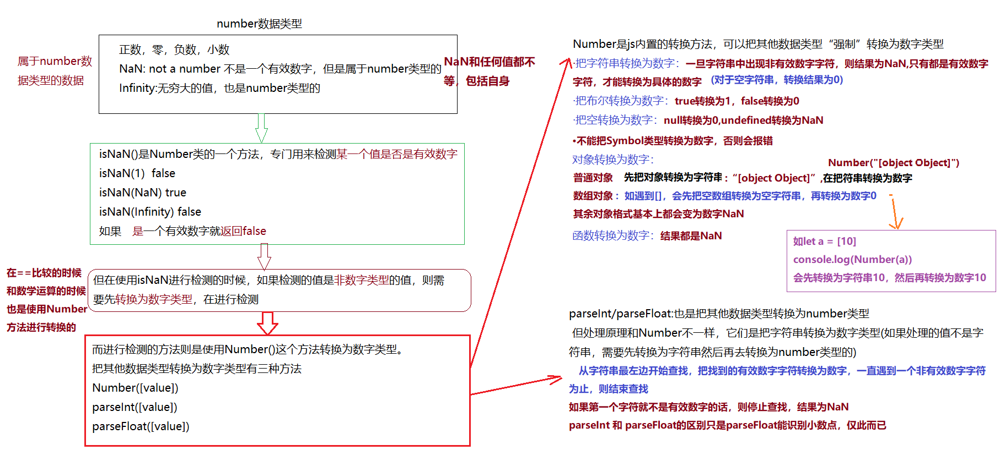

# JavaScript 语法

## 数据类型
在 [MDN](https://developer.mozilla.org/zh-CN/docs/Web/JavaScript/Data_structures) 得知最新的ECMAScript标准定义了8种数据类型。
:::tip
原始数据类型：Number、String、Boolean、Null、Undefined、Symbol(ES6)、BigInt

引用数据类型: Objact
:::

### Number
<a data-fancybox title="image" href="/blog/assets/img/number.852527bd.jpg"></a>

### String
在js中用单引号/双引号/反引号 包起来的都是字符串。

把其他数据类型转为 <font color="#3EAF7C">**字符串类型**</font> 的方法。
```js
String（[value]）
[value].toString()
```

**[value].toString()**

从 [MDN](https://developer.mozilla.org/zh-CN/search?q=toString) 得知,此方法的作用是将<font color="#000000">**指定的对象以字符串的形式返回**</font>。每个对象都有一个 toString() 方法。默认情况下，toString() 方法被每个 Object 对象继承。如果此方法在<font color="#3EAF7C">**自定义对象**</font>中未被覆盖，toString() 返回` "[object type]"`，其中  <font color="#FA8072">type</font> 是对象的类型

toString()这个方法不能用于，null，undefined，会报错,如下:
```js
console.log(null.totring());
console.log(undefined.toString());
//Uncaught TypeError

```
:::warning null undefined
根据ECMAScript 5 和随后的 Errata 中所定义，从 JavaScript 1.8.5 开始，`toString()` 调用 `null` 返回`[object Null]`，`undefined` 返回 `[object Undefined]`。
:::

直接写数字也会报错,如下：
```js
console.log(1.totring());
// Uncaught SyntaxError: Invalid or unexpected token
//解决方案
console.log(1..toString());
console.log((1).toString());
console.log('1'.toString());
let num = 1;
console.log(num.toString());
```
:::warning number
直接写数字会报错的原因，因为js中只有一种数字类型：基于 <font color="#FA8072">IEEE 754</font> 标准的双精度。它并没有为整数给出一个特定的类型，所以所有的数字都是小数
:::

其他数据类型的情况,如下：
```js
console.log(Symbol.toString()); //function Symbol() { [native code] }
console.log([1,2].toString()); //1,2
console.log({}.toString()); //[object Object]
```