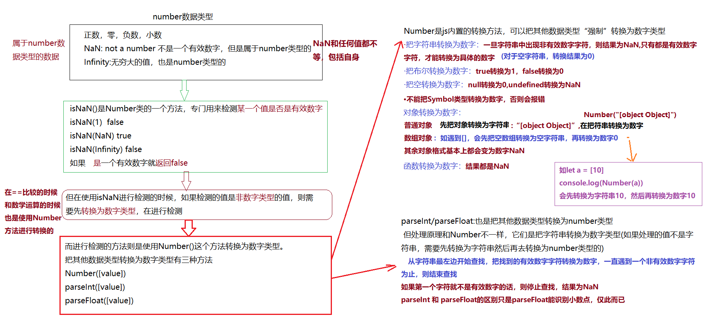
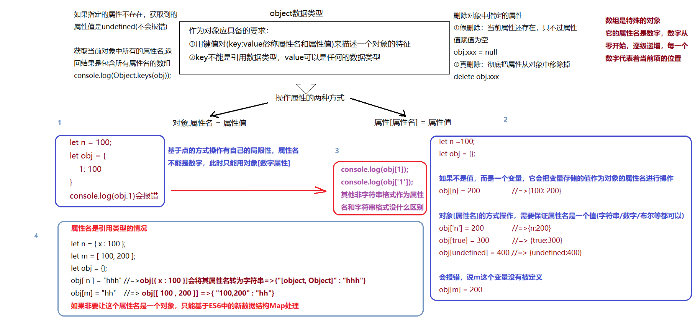

# 数据类型
在 [MDN](https://developer.mozilla.org/zh-CN/docs/Web/JavaScript/Data_structures) 得知最新的ECMAScript标准定义了8种数据类型。
:::tip
原始数据类型：Number、String、Boolean、Null、Undefined、Symbol(ES6)、BigInt

引用数据类型: Objact
:::

## Number
<a data-fancybox title="image" href="/blog/assets/img/number.852527bd.jpg"></a>


## String
* 在js中用单引号/双引号/反引号 包起来的都是字符串。

* 把其他数据类型转为 <font color="#3EAF7C">**字符串类型**</font> 的方法。
```js
String（[value]）
[value].toString()
```

### [value].toString()

从 [MDN](https://developer.mozilla.org/zh-CN/search?q=toString) 得知,此方法的作用是将<font color="#000000">**指定的对象以字符串的形式返回**</font>。每个对象都有一个 toString() 方法。默认情况下，toString() 方法被每个 Object 对象继承。如果此方法在<font color="#3EAF7C">**自定义对象**</font>中未被覆盖，toString() 返回` "[object type]"`，其中  <font color="#FA8072">type</font> 是对象的类型

toString()这个方法不能用于，null，undefined，会报错,如下:
```js
console.log(null.totring());
console.log(undefined.toString());
//Uncaught TypeError

```
:::warning null undefined
根据ECMAScript 5 和随后的 Errata 中所定义，从 JavaScript 1.8.5 开始，`toString()` 调用 `null` 返回`[object Null]`，`undefined` 返回 `[object Undefined]`。
:::

直接写数字也会报错,如下：
```js
console.log(1.totring());
// Uncaught SyntaxError: Invalid or unexpected token
//解决方案
console.log(1..toString());
console.log((1).toString());
console.log('1'.toString());
let num = 1;
console.log(num.toString());
```
:::warning number
直接写数字会报错的原因，因为js中只有一种数字类型：基于 <font color="#FA8072">IEEE 754</font> 标准的双精度。它并没有为整数给出一个特定的类型，所以所有的数字都是小数
:::

其他数据类型的情况,如下：
```js
console.log(Symbol.toString()); //function Symbol() { [native code] }
console.log([1,2].toString()); //1,2
console.log({}.toString()); //[object Object]
```

### String()

可以将任何类型的都转为字符串。

* **数学运算**

在js中常用的数学运算，除了加法以外，其余都是数学运算:

 对于非加法运算而言，如果遇到<font color="#3EAF7C">**非数字类型**</font>，需要基于 <font color="#FA8072">Number</font> 把其强制转换为数字类型，然后再进行运算的

 加号在js中既有<font color="#3EAF7C">**数学运算**</font>，也有<font color="#3EAF7C">**字符串拼接**</font>的意思只要加号两边的任意一边出现字符串，则变为字符串拼接, 原理是这种情况下会进行隐式转换，<font color="#FA8072">String（）</font> 方法会被触发。对于拼接的是Symbol类型的话会报错，因为Symbol类型只能被显式的转换

## Boolean
只有 `0/NaN/null/undefined/空字符串`  最后是 `false `，其余都是 `true`
```js
console.log(!!-1) 		     //true
console.log(!!0)		     //false
console.log(!!undefined)	 //false
console.log(!!Number('1px')	 //false
console.log(!![])		     //true
console.log(!!'')		     //false
console.log(!!{})		     //true
```
:::tip
在条件判断中，每一个条件都会被转换为boolean
:::

 ## null和undefined
 它们不同于其他数据类型，，这两个分类只包含一种情况，就是它们 <font color="#3EAF7C">**本身**</font>。

### undefined出现的场景

>声明变量未赋值  
>访问对象上不存在的属性  
>函数定义了形参，但调用时未传实参  

总结：undefined出现多是数据原始状态的保留结果。
undefined表示缺少值，就是此处应该<font color="#3EAF7C">**有一个值**</font>，但是还没有定义


### null

人为的将它变成没有对象的野指针。  
也就是说，此时此刻，栈内存中的变量<font color="#000000">**不在指向堆内存中的任何对象**</font>，流离失所null表示没有对象，此处<font color="#3EAF7C">**不应该有值**</font>。

## Symbol
Symbol是ES6中新增的数据类型。es5的对象属性名都是字符串，这容易造成 <font color="#3EAF7C">**属性名的冲突**</font>。比如使用了一个他人提供的对象，但又想为这个对象添加方法，这个新方法的名字就有可能与现有的方法产生冲突。如果有一种机制，保证每一个属性的名字都是独一无二的，这样就从根本上防止属性名的冲突，这就是es6引入symbol的原因


Symbol值通过Symbol函数生成。所以说，对象的属性名现在可以有两种类型，一种是原来的字符串，另一种就是新增的Symbol类型。

Symbol函数前不能使用new命令，否则会报错。这是因为生成的Symbol是一个原始类型的值，不是对象。所以也不能添加数据，基本上，它是一种类似于字符串的数据类型。
```js
let s = new Symbol();
//Uncaught TypeError: Symbol is not a constructor
```

Symbol函数的参数只是表示对当前Symbol值的描述，因此相同参数的Symbol函数的返回值是不相等的

```js
// 没有参数的情况
let s1 = Symbol();
let s2 = Symbol();

s1 === s2 // false

// 有参数的情况
let s1 = Symbol('foo');
let s2 = Symbol('foo');

s1 === s2 // false
```

## BigInt
BigInt是ES2020引入的一种新的数据类型。

在 <font color="#FA8072">IEEE 754</font> 标准下，JS无法精确将非常大的整数进行自动四舍五入，JS 中的Number类型只能安全地表示 <font color="#FA8072">-9007199254740991 (-(2^53-1))</font> 和 <font color="#FA8072">9007199254740991(2^53-1)</font> 之间的整数，任何超出此范围的整数值都可能失去精度。
```js
console.log(9999999999999999);    // → 10000000000000000
```
意外四舍五入会损害程序的可靠性和安全性,如下：
```js
9007199254740992 === 9007199254740993;    // → true
```
以前，为了解决这种问题，JS 提供 `Number.MAX_SAFE_INTEGER` 常量来表示 最大安全整数，`Number.MIN_SAFE_INTEGER`常量表示最小安全整数。
```js
let maxNum = Number.MAX_SAFE_INTEGER;
console.log(Number.MAX_SAFE_INTEGER); //9007199254740991
console.log(Number.MAX_SAFE_INTEGER - 100); //9007199254740991
```
而使用BigInt，可以解决上面的问题。创建BigInt，只需要在整数的末尾追加n即可,如下：
```js
console.log(9999999999999999n);  //9999999999999999n
```
或者，可以调用BigInt()构造函数,如下：
```js
BigInt("9999999999999999"); //9999999999999999n
```
BigInt类型的数字也可以进制转换,但不能使用 <font color="#3EAF7C">**严格相等运算符**</font> 将BigInt与常规数字进行比较，因为它们的类型不同：
```js
console.log(10n === 10);    // → false

console.log(typeof 10n);    // → bigint
console.log(typeof 10);     // → number
```

## Object
<a data-fancybox title="object" href="/blog/assets/img/object.376c91e0.jpg"></a>
